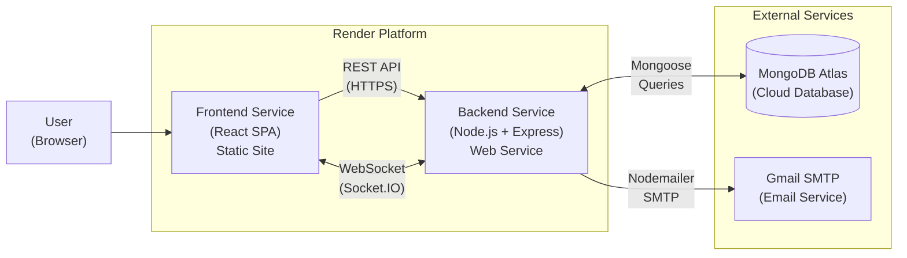

# Chapter 2: Survey of Technology

This chapter provides a comprehensive analysis of the technologies, frameworks, libraries, and services employed in the development and deployment of Privacy Chat. Each technology was selected after careful evaluation of alternatives, considering factors such as maturity, community support, performance characteristics, licensing, documentation quality, and suitability for building real-time, privacy-focused web applications.

---

## 2.1 Frontend Technologies

### 2.1.1 React 19

Category: UI Library
Version: 19.2.0
Role: Core user interface rendering engine

React is a declarative, component-based JavaScript library for building user interfaces, originally developed by Jordan Walke at Facebook in 2013 and now maintained by Meta. With over 220,000 GitHub stars and adoption by companies such as Netflix, Airbnb, Instagram, and Uber, React has become the most widely used frontend library in modern web development. React was selected over alternatives such as Angular (a full opinionated framework with a steep learning curve) and Vue.js (a progressive framework with a smaller ecosystem) because of its lightweight nature, vast ecosystem of third-party libraries, unmatched community support, and the flexibility of its component-driven architecture.

Privacy Chat uses React 19's functional component paradigm exclusively, leveraging modern hooks for state and lifecycle management:

- useState: Manages local component state for form inputs, UI toggles (modals, dropdowns), message lists, and selection states.
- useEffect: Handles side effects such as fetching contacts on component mount, subscribing to Socket.IO events for real-time updates, and performing cleanup on component unmount to prevent memory leaks.
- useRef: Provides direct DOM access for auto-scrolling chat containers to the latest message and managing file input element references without triggering re-renders.
- useCallback: Creates memoised event handler functions to prevent unnecessary re-renders in child components, particularly important for frequently invoked functions like message sending handlers.
- useContext: Enables global state access for authentication (AuthContext), socket connections (SocketContext), and theme preferences (ThemeContext) without the complexity of prop drilling through deeply nested component trees.

React employs a virtual DOM reconciliation algorithm that computes the minimal set of actual DOM mutations required when the application state changes. This is particularly beneficial for a chat application where new messages arrive in real-time and the UI must update frequently without perceptible lag or jank.

### 2.1.2 Vite 7

Category: Build Tool and Development Server
Version: 7.3.1
Role: Development server with Hot Module Replacement (HMR) and optimised production bundling

Vite (French for "fast") is a next-generation frontend build tool created by Evan You, the creator of Vue.js, and released in 2020. Vite was chosen over Create React App (CRA), which uses Webpack internally, because CRA's bundler-based development server becomes progressively slower as the project grows, often taking 10 to 30 seconds for initial startup on medium-sized projects. In contrast, Vite's architecture leverages native ES module support in modern browsers to serve source files directly during development, resulting in near-instant server startup regardless of project size.

Key benefits realised in this project:

- Native ES Module Dev Server: During development, Vite serves each source file as a native ES module via HTTP. The browser's built-in module resolution handles dependency loading, completely eliminating the bundling step and reducing server startup to under one second.
- Hot Module Replacement (HMR): When a React component is modified, only the affected module is replaced in the browser without a full page reload. Component state such as chat scroll position, form inputs, and modal visibility is preserved during development, significantly improving developer productivity.
- Optimised Production Builds: For production deployments, Vite uses Rollup as its bundler, performing tree-shaking to eliminate dead code, code splitting to generate smaller chunks for lazy loading, and minification to reduce bundle size. The resulting output is a highly optimised set of static assets suitable for CDN deployment.
- Environment Variable Support: Vite exposes environment variables prefixed with `VITE_` to the client-side code at build time. Privacy Chat uses `VITE_API_URL` to configure the backend API endpoint, enabling seamless switching between local development and production environments without code changes.

### 2.1.3 React Router DOM 7

Category: Client-Side Routing Library
Version: 7.13.1
Role: Single-page application (SPA) navigation and route protection

React Router DOM is the standard routing solution for React applications, providing declarative, component-based routing that integrates seamlessly with React's component model. It enables the application to function as a single-page application where navigation between views occurs entirely on the client side without full page reloads from the server.

Privacy Chat defines the following application routes:

- Public routes: `/login`, `/register`, `/forgot-password`
- Protected routes: `/chat`, `/chat/:userId`, `/group/:groupId`, `/profile`

A custom ProtectedRoute wrapper component checks for the presence and validity of a JWT token before rendering authenticated pages. Unauthenticated users are automatically redirected to the login page. The `useParams()` hook extracts dynamic route segments such as `:userId` for DM conversations and `:groupId` for group chats, enabling the application to load the correct conversation context from the URL. The `useNavigate()` hook provides programmatic navigation for redirecting users after login, logout, contact removal, and private session lifecycle events.

### 2.1.4 Tailwind CSS 4

Category: Utility-First CSS Framework
Version: 4.2.1
Role: Rapid UI styling with responsive design and dark mode support

Tailwind CSS, created by Adam Wathan in 2017, takes a fundamentally different approach to styling compared to traditional CSS frameworks like Bootstrap. Rather than providing pre-built component classes, Tailwind provides low-level utility classes (such as `flex`, `p-4`, `text-white`, `rounded-lg`) that can be composed directly in markup to build custom designs without writing separate CSS stylesheets. This utility-first approach was chosen because it eliminates the need for custom CSS files, avoids naming collisions, and produces smaller production bundles through automatic purging of unused classes.

Key features utilised in Privacy Chat:

- Responsive Design: Built-in responsive breakpoints (`sm:`, `md:`, `lg:`, `xl:`) enable the application to adapt seamlessly to mobile, tablet, and desktop viewports using conditional utility classes.
- Dark Mode: Privacy Chat implements a user-toggleable dark and light theme using a `data-theme` attribute on the root HTML element. Tailwind's dark mode variant applies conditional styling, and the user's preference is persisted in `localStorage` to survive page reloads and browser restarts.
- Component Styling: All UI elements including chat message bubbles, input fields, modals, dropdown menus, notification badges, and navigation bars are styled using composable utility classes directly within JSX, co-locating structure and styling for improved maintainability.

### 2.1.5 Axios 1

Category: Promise-Based HTTP Client
Version: 1.13.5
Role: REST API communication with request and response interceptors

Axios is a promise-based HTTP client for both browser and Node.js environments, chosen over the browser's native Fetch API for its superior developer experience, including automatic JSON parsing, request and response interceptors, request cancellation, and more informative error handling with HTTP status codes directly accessible on error objects.

Privacy Chat uses Axios with two critical interceptors:

- Request Interceptor: Automatically retrieves the JWT token from `localStorage` and attaches it to the `Authorization` header of every outgoing HTTP request. This eliminates the need to manually pass authentication credentials in each API call throughout the application.
- Response Interceptor: Detects `401 Unauthorized` responses indicating expired or invalid tokens, automatically clears stale credentials from `localStorage`, and redirects the user to the login page. This provides a seamless session expiry experience without requiring manual error handling in every component.
- Base URL Configuration: The API base URL is configured via the `VITE_API_URL` environment variable, allowing seamless switching between the local development server (`http://localhost:5000/api`) and the production deployment (`https://backend.onrender.com/api`) without any code modifications.

### 2.1.6 Socket.IO Client 4

Category: Real-Time WebSocket Client Library
Version: 4.8.3
Role: Persistent bidirectional communication between browser and server

Socket.IO is a library that enables real-time, bidirectional, and event-based communication between the browser and the server. It was created by Guillermo Rauch in 2010 and has become the de facto standard for WebSocket communication in the JavaScript ecosystem. Socket.IO was chosen over raw WebSocket APIs because it provides automatic reconnection with exponential backoff, transparent fallback to HTTP long-polling when WebSocket connections are blocked by firewalls or proxies, room-based event broadcasting, and a robust acknowledgement mechanism. These features are essential for a chat application that must maintain reliable real-time communication under varying network conditions.

Privacy Chat's Socket.IO client handles the following real-time events:

- Events Emitted to Server: `typing:start`, `typing:stop`, `message:read`, `beacon:cleanup` (sent via the Beacon API when a browser tab is closing)
- Events Received from Server: `notification:receive` (new messages, invitation alerts, private session lifecycle events), `users:online` (broadcast of currently connected user IDs), `typing:start`, `typing:stop` (typing indicator updates)
- Authentication: The JWT token is passed via `socket.handshake.auth.token` during the initial WebSocket handshake. The server-side Socket.IO middleware verifies this token before allowing the connection to proceed.
- Automatic Reconnection: Socket.IO's built-in reconnection engine automatically attempts to re-establish the connection when network interruptions occur, using configurable exponential backoff delays to avoid overwhelming the server.

---

## 2.2 Backend Technologies

### 2.2.1 Node.js 18+ (LTS)

Category: Server-Side JavaScript Runtime
Role: Application server runtime environment

Node.js is an open-source, cross-platform JavaScript runtime built on Google's V8 engine, originally created by Ryan Dahl in 2009. It introduced the concept of server-side JavaScript, enabling developers to use a single programming language across both the frontend and backend of a web application. Node.js employs an event-driven, non-blocking I/O model that makes it particularly well-suited for I/O-intensive applications such as real-time chat servers, where the server must manage thousands of concurrent WebSocket connections with minimal computational overhead per connection.

Node.js was selected over alternatives such as Python (Django/Flask), Java (Spring Boot), and PHP (Laravel) because it provides the lowest-latency WebSocket integration, shares the JavaScript language with the React frontend enabling code and type sharing, and has a mature ecosystem of real-time communication libraries.

Key Node.js features used in Privacy Chat:

- ES Module Support: The project uses native ECMAScript module syntax (`import`/`export`) enabled via the `"type": "module"` declaration in `package.json`, providing modern module resolution and better static analysis.
- Built-in crypto Module: Used for generating cryptographically secure UUIDs (`crypto.randomUUID()`) for private session message identifiers without requiring any external dependency.
- Event Loop Architecture: Node.js processes all I/O operations asynchronously through its event loop, enabling a single server process to handle hundreds or thousands of concurrent chat connections without spawning additional threads or processes.

### 2.2.2 Express 5

Category: Web Application Framework
Version: 5.2.1
Role: REST API routing, middleware pipeline, and static file serving

Express is a minimal, unopinionated web application framework for Node.js, first released in 2010 by TJ Holowaychuk. It is the most widely used Node.js web framework, forming the "E" in the popular MERN (MongoDB, Express, React, Node.js) stack. Express 5 introduces native support for async route handlers (returned Promise rejections are automatically caught), which simplifies error handling throughout the application.

Privacy Chat uses Express to implement a layered middleware pipeline and modular route architecture:

- Route Modules: Five dedicated route files (`auth.js`, `contacts.js`, `groups.js`, `invitations.js`, `messages.js`) handle all REST API endpoints, providing clear separation of concerns and maintainability.
- Middleware Pipeline: Every incoming HTTP request passes through a series of middleware functions in a defined order: Helmet (security headers) then CORS (origin validation) then express.json() (body parsing) then route-specific middleware such as rate limiting, JWT authentication, and Multer file upload handling.
- Static File Serving: The `/uploads` directory is served via `express.static()` to provide direct download URLs for uploaded avatar images and chat file attachments.
- Socket.IO Integration: The Socket.IO server instance is attached to the Express application via `app.set('io', io)`, making it accessible within REST route handlers. This allows REST API operations (such as sending a message or accepting an invitation) to trigger real-time Socket.IO notifications to other connected users.

### 2.2.3 Socket.IO Server 4

Category: Real-Time Communication Engine
Version: 4.8.3
Role: WebSocket server for bidirectional event-driven communication

The server-side Socket.IO library manages all real-time communication features through a structured, event-based architecture. It operates as a layer on top of the Node.js HTTP server, upgrading HTTP connections to persistent WebSocket connections and providing abstractions for room-based broadcasting, targeted message delivery, and connection lifecycle management.

Core features implemented in Privacy Chat:

- Online Presence Tracking: A `Map<userId, socketId>` data structure maintains the mapping between authenticated user IDs and their active socket connections. The full list of online user IDs is broadcast to all connected clients whenever a user connects or disconnects.
- Targeted Message Delivery: The `sendNotification()` helper function looks up a specific user's socket ID from the online users map and emits events directly to that individual socket, avoiding the overhead and privacy concerns of broadcasting to all connected clients.
- Room-Based Group Communication: When a user connects, they are automatically joined to Socket.IO rooms named `group:<groupId>` for each group they belong to. This enables efficient group-wide event broadcasting (messages, typing indicators, session events) without iterating over individual member sockets.
- JWT Authentication Middleware: A custom Socket.IO middleware intercepts every new connection attempt, extracts the JWT token from the handshake authentication payload, verifies it against the server secret, and rejects unauthenticated connections before they can receive any events.
- Disconnect Cleanup: When a socket disconnects (whether due to network failure, tab closure, or browser exit), the server automatically ends any active private sessions for that user and clears the associated in-memory messages, ensuring no orphaned ephemeral data remains.

### 2.2.4 MongoDB Atlas and Mongoose 9

Category: Cloud Database and Object Document Mapper (ODM)
MongoDB Version: Cloud-hosted (Atlas M0 cluster)
Mongoose Version: 9.2.2
Role: Persistent data storage with schema validation, indexing, and query building

MongoDB is a document-oriented NoSQL database that stores data in flexible, JSON-like BSON documents. It was created by MongoDB, Inc. in 2009 and has become the leading NoSQL database for web applications. MongoDB was chosen over relational databases such as PostgreSQL or MySQL because chat applications produce semi-structured data (messages with varying fields such as text-only, text-with-file, or file-only) that maps naturally to the document model without requiring null columns or complex join operations. MongoDB's native support for array fields eliminates the need for SQL-style junction tables when modelling relationships such as contacts, group members, and read receipts.

MongoDB Atlas, the fully managed cloud database service, provides:

- Flexible Document Schema: Chat messages, user profiles, groups, invitations, and sessions are each represented as JSON documents in dedicated collections, with fields that can vary between documents as needed.
- Array-Based Relationships: Related entity IDs (contacts, members, admins, readBy, deletedFor) are stored as embedded arrays within parent documents, reducing query complexity and eliminating junction collection lookups.
- TTL Indexes: A time-to-live index on the `VerificationCode.expiresAt` field enables automatic document expiration. MongoDB's background TTL monitor thread purges expired verification codes without requiring any application-level scheduled cleanup logic.
- Performance Indexes: The `conversationId` field is indexed for efficient DM message retrieval, and the `email` field is uniquely indexed for user lookups during authentication.
- Cloud Infrastructure: The Atlas M0 free cluster provides 512 MB of storage with automated backups, network access controls, database user authentication, and encryption at rest.

Mongoose 9 serves as the Object Document Mapper (ODM) layer between Node.js and MongoDB:

- Schema Definitions: Mongoose schemas enforce field types, required constraints, default values, min/max lengths, enum validation, and unique constraints at the application level, providing a safety net beyond MongoDB's native schema validation.
- Middleware Hooks: A `post('findOneAndDelete')` hook on the User schema automatically cascades contact removal when a user is deleted, pulling their ObjectId from all other users' contacts arrays.
- Population: The `.populate()` method resolves ObjectId references to full document data. For example, `.populate('sender', 'username avatar')` replaces a message's sender ObjectId with the sender's username and avatar URL in API responses.

### 2.2.5 JSON Web Token (jsonwebtoken) 9

Category: Stateless Authentication Library
Version: 9.0.3
Role: Secure, scalable, stateless user authentication

JSON Web Tokens (JWT) are an open standard (RFC 7519) for securely transmitting claims between parties as a compact, URL-safe JSON object. JWTs enable stateless authentication, meaning the server does not need to maintain session state in memory or a database. Each token is self-contained, carrying the user's identity and an expiry timestamp, and is cryptographically signed to prevent tampering.

Privacy Chat's JWT implementation:

- Token Payload: `{ id: userId, username: username, iat: issuedAt, exp: expiryTimestamp }`
- Token Lifetime: 7-day expiry (`expiresIn: '7d'`), balancing user convenience (avoiding frequent re-logins) with security (limiting the window of exposure for a compromised token).
- Signing Algorithm: HMAC-SHA256 (HS256) using a server-side secret stored in the `JWT_SECRET` environment variable. This symmetric signing algorithm ensures that tokens can only be generated and verified by the server.
- Dual Verification: Tokens are verified in two places: the Express HTTP middleware (for REST API requests) and the Socket.IO connection middleware (for WebSocket connections), ensuring unified authentication across both communication channels.

### 2.2.6 bcrypt 6

Category: Adaptive Password Hashing Library
Version: 6.0.0
Role: Secure one-way password hashing and verification

bcrypt is an adaptive password hashing function designed by Niels Provos and David Mazieres in 1999, based on the Blowfish cipher. It is specifically designed for password storage, incorporating a configurable work factor (salt rounds) that can be increased over time as hardware becomes faster, ensuring the hash computation remains computationally expensive enough to resist brute-force attacks.

Privacy Chat's bcrypt configuration:

- Salt Rounds: 12 rounds (2 to the power of 12 = 4,096 hashing iterations), providing a strong balance between security and login response time. Each hash operation takes approximately 200 to 300 milliseconds on modern hardware.
- Password Hashing: Passwords are hashed using `bcrypt.hash(password, 12)` during user registration and password change operations. The plaintext password is never stored or logged.
- Password Verification: During login and password confirmation flows, `bcrypt.compare(plaintextPassword, storedHash)` compares the provided password against the stored hash without ever reversing the hash.
- Irreversibility: bcrypt hashes are mathematically one-way. Even database administrators with direct access to the database cannot recover plaintext passwords from stored hashes.

### 2.2.7 Multer 2

Category: Multipart Form-Data Middleware
Version: 2.1.1
Role: File upload parsing, validation, and storage

Multer is Express middleware for handling `multipart/form-data` requests, which is the encoding type used for file uploads in HTML forms. It is the standard file upload handler for Express applications.

Privacy Chat uses Multer for both avatar uploads and chat file sharing:

- Disk Storage Engine: Uploaded files are written to the server's filesystem in the `/uploads` directory with a configurable storage engine that controls filename generation and destination.
- MIME Type Whitelist: A comprehensive whitelist of over 30 allowed MIME types covering images (JPEG, PNG, GIF, WebP, SVG), documents (PDF, Word, Excel, PowerPoint, text), audio (MP3, WAV, OGG, M4A), and video (MP4, WebM, AVI, MOV) rejects any file with an unauthorised content type, protecting against malicious file uploads.
- File Size Limit: A maximum upload size of 100 MB per file prevents denial-of-service attacks through excessively large uploads.
- Filename Sanitisation: Original filenames are sanitised by replacing special characters (including path traversal sequences like `../`) with underscores and prepending a Unix timestamp to prevent filename collisions when multiple users upload files with the same name.

### 2.2.8 Nodemailer 8

Category: Email Sending Library
Version: 8.0.4
Role: SMTP email delivery for account verification and password recovery

Nodemailer is the most popular email sending library for Node.js, supporting SMTP, sendmail, Amazon SES, and other transport mechanisms. Privacy Chat uses Nodemailer to send 6-digit OTP verification codes via email for two critical authentication flows:

- User Registration: After a user submits their registration form, a 6-digit numeric OTP is generated, stored in the database with a 10-minute expiry, and sent to the provided email address. The user must enter this code to complete registration, verifying email ownership.
- Password Recovery: When a user initiates the forgot password flow, a verification code is sent to their registered email address. After verifying the code, they can set a new password.

Transport configuration:

- Production Environment: Gmail SMTP with App Password authentication (a 16-character application-specific password generated from Google Account security settings).
- Development Environment: Ethereal.email, a free disposable SMTP service that captures outgoing emails in a web-based inbox for testing without delivering them to real recipients.

### 2.2.9 Security Middleware Stack

The backend employs a layered security middleware stack that processes every incoming HTTP request:

| Library | Version | Purpose |
|---------|---------|---------|
| Helmet | 8.1.0 | Automatically sets 15+ HTTP security headers including Content-Security-Policy, X-Frame-Options (clickjacking prevention), X-Content-Type-Options (MIME sniffing prevention), Strict-Transport-Security (HSTS for HTTPS enforcement), and Referrer-Policy. Configured with `crossOriginResourcePolicy: 'cross-origin'` to permit file downloads from the frontend domain. |
| express-rate-limit | 8.3.1 | Rate limiting on authentication routes to prevent brute-force password attacks: maximum 20 requests per 15-minute window per IP address. Exceeding the limit returns a 429 Too Many Requests response with a descriptive error message. |
| cors | 2.8.6 | Cross-Origin Resource Sharing configuration that restricts API access exclusively to requests originating from the frontend domain specified in the `CLIENT_URL` environment variable. All requests from other origins are rejected with a CORS error. |
| dotenv | 17.3.1 | Loads environment variables from `.env` files during local development. In production on Render, environment variables are configured via the platform's dashboard and injected into the process environment at startup. |

---

## 2.3 Database Architecture

### 2.3.1 MongoDB Atlas (Cloud Database)

MongoDB Atlas was selected as the primary persistent data store for the following reasons:

1. Flexible Document Schema: Chat messages with varying field combinations (text-only, text-with-file, file-only) are naturally represented as JSON documents without requiring null columns or complex table designs typical of relational databases.
2. Horizontal Scalability: Atlas supports horizontal scaling through sharding, allowing the database to grow beyond a single server's capacity as the user base increases.
3. Free Tier Availability: The M0 free cluster provides 512 MB of storage with shared RAM and vCPU, sufficient for development, testing, and small-scale production deployment without incurring any hosting costs.
4. Built-in Security: Atlas provides network access controls (IP whitelisting), database user authentication with role-based access, encryption at rest using AES-256, and encryption in transit using TLS 1.2+.
5. Managed Operations: Automated backups, monitoring dashboards, performance advisors, and index suggestions reduce operational overhead.

### 2.3.2 In-Memory Volatile Store (JavaScript Map)

For private and ephemeral messages, a deliberate architectural decision was made to use a JavaScript `Map` data structure rather than any persistent or semi-persistent storage mechanism:

- Data Structure: `Map<sessionId, Array<messageObject>>` where each active private session maintains an array of message objects in server process memory.
- Why not Redis? Although Redis is commonly used for in-memory data storage, it provides optional persistence mechanisms (RDB snapshots and AOF append-only logs) that could inadvertently persist private messages to disk. A JavaScript `Map` exists exclusively in the Node.js process heap and is guaranteed to be destroyed on process termination, providing an architectural guarantee of ephemerality.
- Why not an encrypted database field? Even encrypted data stored in a database could potentially be decrypted if the encryption key is compromised through a breach or legal compulsion. By never writing private messages to any storage medium at any point in their lifecycle, recovery is rendered physically impossible regardless of key compromise.
- Lifecycle: Private messages are created when sent during an active session, accumulated in the Map array, and irrecoverably destroyed (via `Map.delete(sessionId)`) when the session ends through any exit path: explicit session end, socket disconnect, tab close via the Beacon API, or server restart.

---

## 2.4 Deployment Infrastructure

The application is deployed as two independent services on the Render cloud platform:

| Service | Role | Configuration |
|---------|------|---------------|
| Render (Backend) | Node.js web service hosting the Express API and Socket.IO server | Auto-deploys from the Git repository on push; environment variables managed via the Render dashboard; persistent `/uploads` directory for file storage |
| Render (Frontend) | Static site hosting for the React SPA production build | Build command: `npm run build`; publish directory: `dist/`; SPA rewrite rules (`/* -> /index.html`) for client-side routing support |
| MongoDB Atlas | Cloud-hosted NoSQL database | M0 free tier cluster; network access whitelisted for Render's outbound IP range; connection string stored as `MONGO_URI` environment variable |
| Gmail SMTP | Transactional email delivery for OTP verification codes | App Password authentication; used exclusively for registration and password recovery OTP emails |
| Git/GitHub | Version control and continuous deployment pipeline | Repository linked to Render for automatic deployment triggered by `git push` to the main branch |

---

## 2.5 Development Tools

| Tool | Version | Purpose |
|------|---------|---------|
| Nodemon | 3.1 | Automatically restarts the Node.js server when source files are modified during development, eliminating manual server restarts |
| ESLint | 9.39 | Static analysis and linting of JavaScript and JSX code with `eslint-plugin-react-hooks` (enforces Rules of Hooks) and `eslint-plugin-react-refresh` (validates Fast Refresh compatibility) |
| Vite HMR | Integrated | Provides instant browser updates during frontend development by replacing only the modified modules without triggering full page reloads |
| Postman / cURL | Latest | Manual API endpoint testing during development, enabling inspection of request and response payloads, headers, and status codes |
| Git | Latest | Distributed version control with feature branching, commit history tracking, and integration with GitHub for remote repository hosting and CI/CD triggers |

---

## 2.6 Technology Stack Summary

| Layer | Technologies |
|-------|-------------|
| Frontend | React 19, Vite 7, React Router DOM 7, Tailwind CSS 4, Axios 1, Socket.IO Client 4 |
| Backend | Node.js 18+, Express 5, Socket.IO Server 4, Multer 2, Nodemailer 8 |
| Database | MongoDB Atlas (Mongoose 9 ODM), In-Memory JavaScript Map (ephemeral store) |
| Authentication | JSON Web Token (jsonwebtoken 9), bcrypt 6 |
| Security | Helmet 8, express-rate-limit 8, CORS, MIME-type whitelisting, filename sanitisation |
| Deployment | Render (backend web service + frontend static site), Git/GitHub CI/CD |
| Email | Gmail SMTP via Nodemailer (OTP verification and password recovery) |
