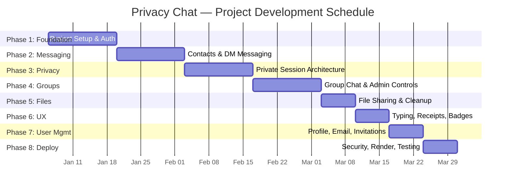
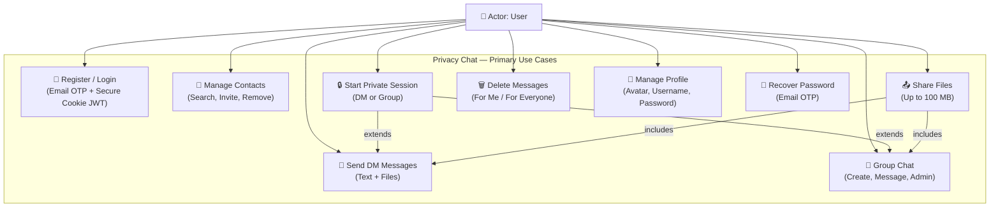

# Chapter 3: Requirement Analysis

## 3.1 Problem Definition

Modern messaging applications — including WhatsApp, Telegram, Signal, and Discord — store all user conversations permanently on centralised servers. This design paradigm creates a persistent and expanding attack surface with several critical privacy implications:

1. Data Breach Exposure: Centralised message stores represent high-value targets for cyberattacks. A single breach can expose millions of private conversations simultaneously.
2. Government Surveillance: Server-stored messages can be subpoenaed, legally compelled, or covertly accessed by government agencies, even across jurisdictional boundaries.
3. Forensic Data Recovery: Even "deleted" messages may be recoverable from database backups, transaction logs, or filesystem-level recovery tools.
4. Cloud Backup Leakage: End-to-end encrypted apps like WhatsApp allow cloud backups (Google Drive, iCloud) that store messages in plaintext or with weak encryption, negating the encryption guarantee.
5. Metadata Retention: Even with E2E encryption, platforms retain metadata (who communicated with whom, when, how often, from which IP addresses), which can be used for profiling.

Users requiring genuinely ephemeral communication — whistleblowers, legal professionals, medical practitioners, journalists, or individuals valuing conversational sovereignty — presently lack any mainstream application that provides an architectural guarantee against message recovery.

Privacy Chat addresses this gap by providing a dual-mode messaging architecture where private messages are stored exclusively in volatile server RAM, never written to any database or persistent storage, and are irrecoverably destroyed on session end, disconnect, or server restart.

---

## 3.2 Drawbacks of Existing Systems

| # | Existing System Drawback | How Privacy Chat Addresses It |
|---|--------------------------|-------------------------------|
| 1 | Permanent Server-Side Storage: All mainstream platforms store messages on servers indefinitely, creating a large data breach attack surface. | Private Mode stores messages exclusively in volatile RAM (`Map` data structure). Messages are physically impossible to recover after session end. |
| 2 | Cloud Backups Undermine Encryption: WhatsApp/Signal cloud backups store messages in plaintext or weak encryption on Google Drive / iCloud. | No cloud backup integration. Private messages never exist in any persistent form. Normal messages reside only in MongoDB Atlas with no user-facing backup export. |
| 3 | Metadata Retention: Even E2E-encrypted platforms retain communication metadata (timestamps, participants, frequency) that can be subpoenaed. | Private sessions do not log metadata to the database. The session record tracks only start/end times and participants — message content and count are never recorded. |
| 4 | Timer-Based Disappearing Messages Are Unreliable: Disappearing message features use client-side timers. Recipients can screenshot, forward, or use modified clients. | Session-based ephemerality is enforced server-side. The client never receives messages outside the active session — when the session ends, the server destroys the data, and the client UI clears immediately. |
| 5 | No True Ephemeral Mode: No mainstream platform offers a mode where messages are architecturally incapable of being persisted. | The `privateStore.js` module uses a JavaScript `Map` that is purely in-process memory. No database driver, no file I/O, no serialisation occurs for private messages. |
| 6 | Anyone Can Message You: Most platforms use phone numbers as identifiers, allowing spam and unsolicited contact from any user. | Privacy Chat uses an invitation-based contact system. Users must send and accept contact requests before any messaging can occur. |
| 7 | No Group Ephemeral Mode: Existing platforms offer no ephemeral/private session capability for group conversations. | Privacy Chat supports admin-initiated private sessions for groups, with the same RAM-only guarantee as DM private sessions. |

---

## 3.3 Requirement Specification

### 3.3.1 Functional Requirements

| ID | Requirement | Priority | Module |
|----|-------------|----------|--------|
| FR-01 | User registration with email verification (6-digit OTP via SMTP) | High | Authentication |
| FR-02 | User login with email and password, JWT-based authentication via `HttpOnly` Cookies | High | Authentication |
| FR-03 | Password recovery via email verification code | High | Authentication |
| FR-04 | Invitation-based contact system (send, accept, decline invitations) | High | Contacts |
| FR-05 | One-to-one (DM) text messaging with E2E Encryption | High | Messaging |
| FR-06 | Group chat with text messaging featuring Group E2E Encryption | High | Groups |
| FR-07 | Private/Ephemeral messaging mode for DMs (RAM-only, session-based) | High | Private Sessions |
| FR-08 | Private/Ephemeral messaging mode for Groups (admin-initiated) | High | Private Sessions |
| FR-09 | File sharing in DMs and groups (images, docs, audio, video; up to 100 MB) | Medium | Messaging |
| FR-10 | File sharing in private mode (files auto-deleted when session ends) | Medium | Private Sessions |
| FR-11 | Real-time typing indicators for DMs and groups | Medium | Real-Time |
| FR-12 | Read receipts (sent → delivered → read status with checkmarks) | Medium | Real-Time |
| FR-13 | Unread message badges on contact/group list | Medium | Real-Time |
| FR-14 | Message deletion: "delete for me" and "delete for everyone" | Medium | Messaging |
| FR-15 | User profile management (avatar upload, username change, password change) | Medium | User Management |
| FR-16 | Online/offline status indicator with real-time updates | Medium | Real-Time |
| FR-17 | User search by username for sending invitations | Medium | Contacts |
| FR-18 | Contact removal with mutual cleanup (chat history and files deleted) | Medium | Contacts |
| FR-19 | Dark mode / Light mode toggle with persistence | Low | UI/UX |
| FR-20 | Notification bell with real-time alerts for messages, invitations, and session events | Medium | Real-Time |
| FR-21 | Automatic session cleanup on tab close (via Beacon API) | Medium | Private Sessions |
| FR-22 | Group admin controls (add/remove members, edit group info, delete group) | Medium | Groups |

### 3.3.2 Non-Functional Requirements

| ID | Requirement | Category |
|----|-------------|----------|
| NFR-01 | Response time under 200ms for API calls under normal load | Performance |
| NFR-02 | WebSocket message delivery latency under 100ms | Performance |
| NFR-03 | Support for concurrent users via Socket.IO's event-driven architecture | Scalability |
| NFR-04 | bcrypt password hashing (12 salt rounds), JWT with 7-day expiry via HttpOnly Cookies, Web Crypto API with IndexedDB | Security |
| NFR-05 | Cross-browser compatibility (Chrome, Firefox, Edge, Safari) | Compatibility |
| NFR-06 | Responsive design for desktop and mobile viewports | Usability |
| NFR-07 | CORS enforcement restricting API access to the frontend domain only | Security |
| NFR-08 | File upload security: MIME type whitelist, filename sanitisation, file size limits | Security |
| NFR-09 | Private messages must never be written to any persistent storage medium | Privacy |
| NFR-10 | System must gracefully handle network interruptions with Socket.IO auto-reconnection | Reliability |

---

## 3.4 Feasibility Study

### 3.4.1 Technical Feasibility

All technologies used in Privacy Chat are mature, well-documented, and open-source:

- Node.js has been in active development since 2009 and is used in production by Netflix, LinkedIn, and PayPal for real-time applications.
- React is maintained by Meta with over 220,000 GitHub stars and is the most widely adopted frontend library.
- MongoDB is the leading NoSQL database with native support for the document structures required by a chat application.
- Socket.IO is the de facto standard for WebSocket communication in Node.js, handling connection fallbacks, reconnection, and room-based broadcasting.
- The ephemeral messaging feature is implemented using Node.js's native `Map` data structure — a standard, proven approach that requires no external dependencies.

The technical stack is well-suited for real-time, privacy-focused applications. No experimental or unproven technologies are used.

### 3.4.2 Economic Feasibility

The entire stack is built on free or open-source technologies with zero licensing costs:

| Resource | Cost |
|----------|------|
| Node.js, Express, React, Vite, Tailwind CSS | Free (open source) |
| MongoDB Atlas (M0 Cluster, 512 MB) | Free tier |
| Render (Backend Web Service, free tier) | Free |
| Render (Frontend Static Site, free tier) | Free |
| Gmail SMTP (low-volume email) | Free |
| GitHub (version control + CI/CD) | Free |
| Total Development & Hosting Cost | ₹0 |

The only potential future cost would be scaling beyond free-tier limits (higher database storage, compute resources, or email volume), which is not required for the scope of this project.

### 3.4.3 Operational Feasibility

- The application runs entirely in a web browser, requiring no installation, plugins, or downloads.
- Users need only a modern browser (Chrome, Firefox, Edge, Safari) and an internet connection.
- The invitation-based contact system reduces spam and unwanted contacts, improving user experience.
- Dark mode and responsive design improve usability across devices and lighting conditions.
- The dual-mode architecture is intuitive — users can clearly distinguish between normal (persistent) and private (ephemeral) conversations through visual UI cues.

---

## 3.5 Planning and Scheduling

The project was developed in 8 phases over a 12-week period:

| Phase | Duration | Key Activities |
|-------|----------|----------------|
| Phase 1: Core Foundation | Week 1–2 | Project initialisation, Express + MongoDB setup, User model, registration, login, JWT authentication |
| Phase 2: Messaging | Week 3–4 | Contact management, DM messaging, Socket.IO integration, message persistence, real-time delivery |
| Phase 3: Privacy Features | Week 5–6 | Private session architecture, RAM-only `Map` store, session lifecycle (start/end/disconnect/tab-close), Beacon API cleanup |
| Phase 4: Groups | Week 7–8 | Group CRUD, group messaging, group private sessions, admin controls, member management |
| Phase 5: File Sharing | Week 9 | Multer file upload, MIME filtering, file messages in DMs/groups/private mode, private file cleanup on session end |
| Phase 6: UX Enhancements | Week 10 | Typing indicators, read receipts (checkmarks), unread badges, message deletion (for me / for everyone), notification bell |
| Phase 7: User Management | Week 11 | Profile page (avatar, username, password), email verification, forgot password flow, invitation system refinement |
| Phase 8: Polish & Deploy | Week 12 | Dark mode, Helmet/rate-limit/CORS hardening, Render deployment (backend + frontend), testing, documentation |

### Gantt Chart

---

## 3.6 Use Case Summary

