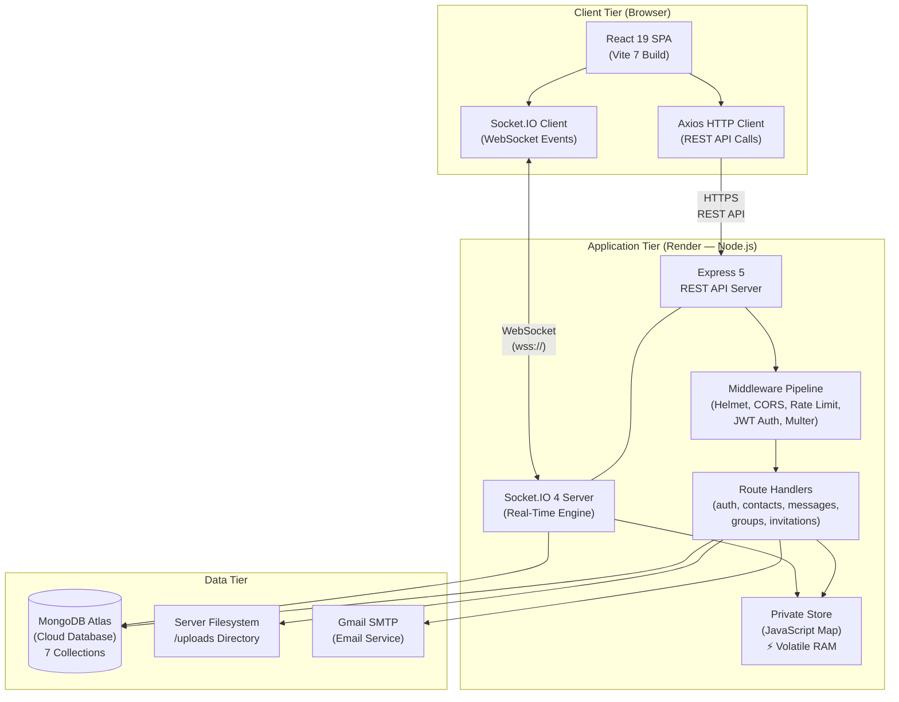
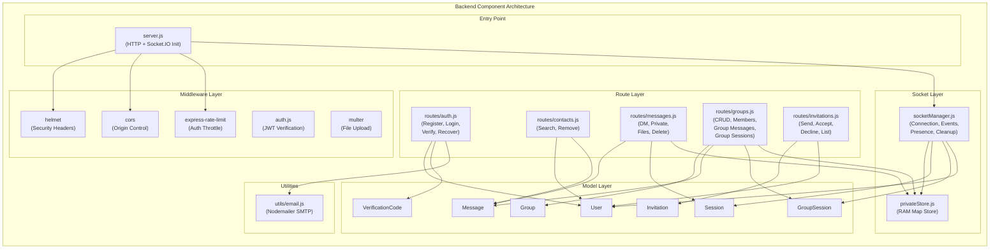
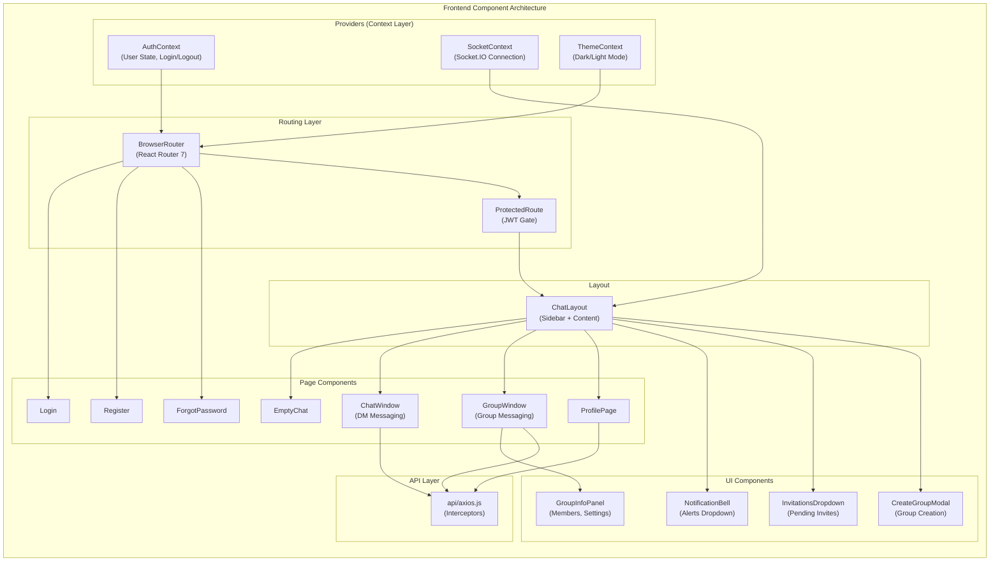
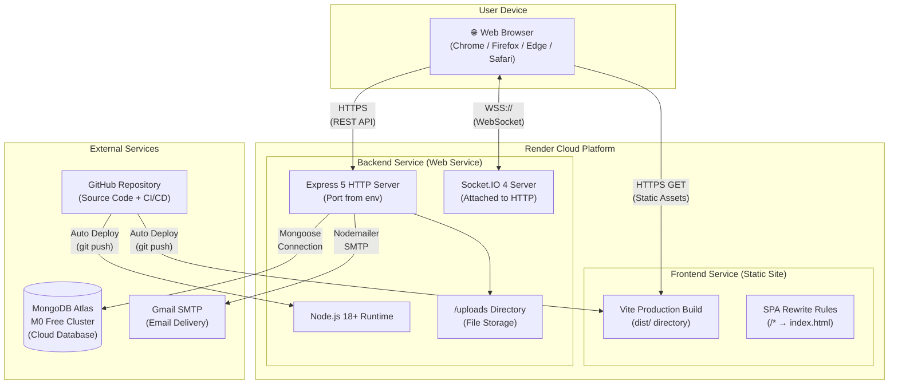
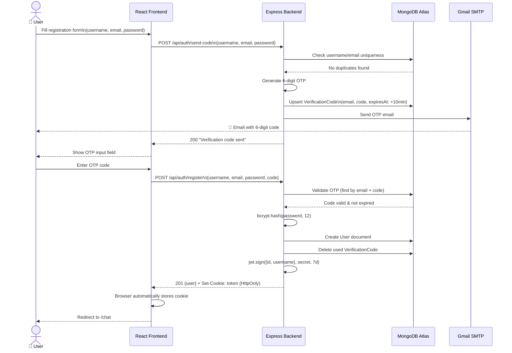
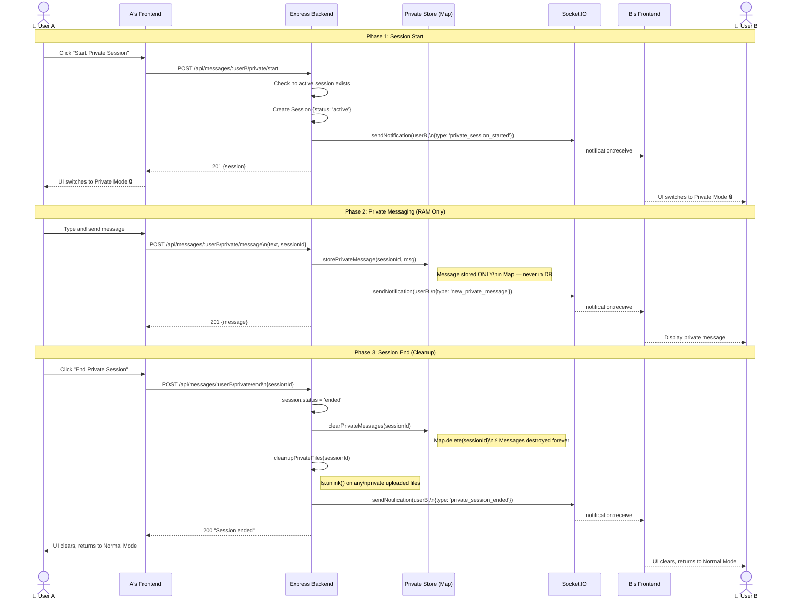
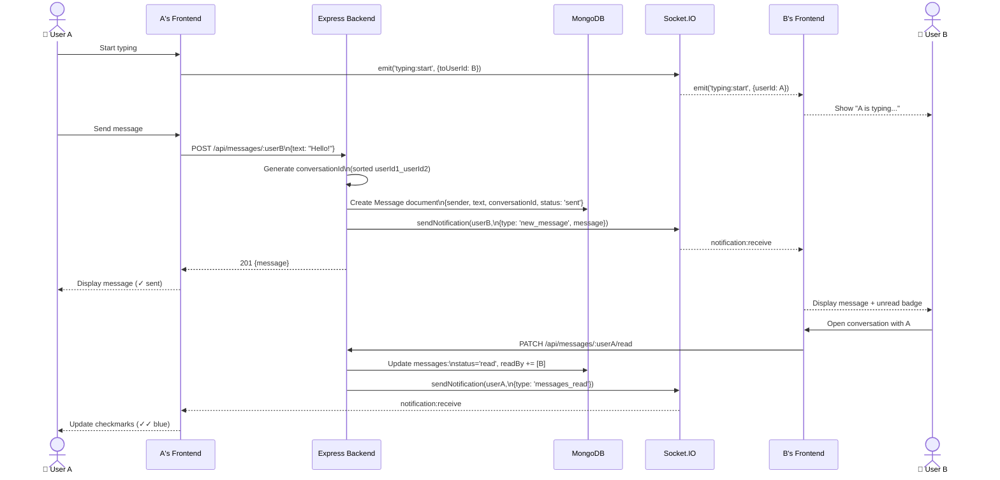
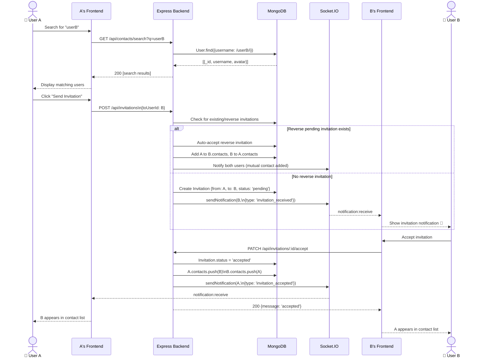
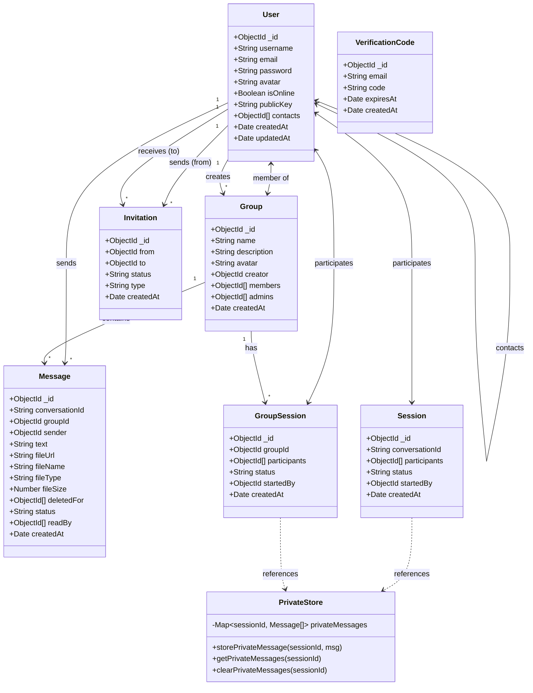

# Chapter 4: System Design

This chapter presents the high-level architectural design of Privacy Chat using standardised diagrams. All diagrams are provided as Mermaid code that can be rendered via [mermaid.live](https://mermaid.live) or any compatible tool and exported as PNG/SVG images for the final report.

---

## 4.1 System Architecture Diagram

The system follows a three-tier, decoupled architecture with separate frontend and backend services communicating via REST APIs and WebSocket connections, backed by a cloud database and in-memory volatile store.

Architectural Highlights:
- Decoupled Frontend/Backend: The React SPA and Node.js API are independently deployed, communicating only via well-defined API contracts and WebSocket events.
- Dual Storage Architecture: Normal messages flow to MongoDB; private messages flow to the in-memory `Map` (shown with ⚡ indicating volatility).
- Middleware Pipeline: Every HTTP request passes through Helmet → CORS → JSON parser → route-specific middleware (rate limiter, JWT auth, Multer upload) before reaching the route handler.

---

## 4.2 Component Diagram

### 4.2.1 Backend Components

### 4.2.2 Frontend Components

---

## 4.3 Deployment Diagram

---

## 4.4 Sequence Diagrams

### 4.4.1 User Registration Flow

### 4.4.2 Private Session Lifecycle (DM)

### 4.4.3 Real-Time DM Messaging Flow

### 4.4.4 Contact Invitation Flow

---

## 4.5 Class Diagram (Backend Models)

