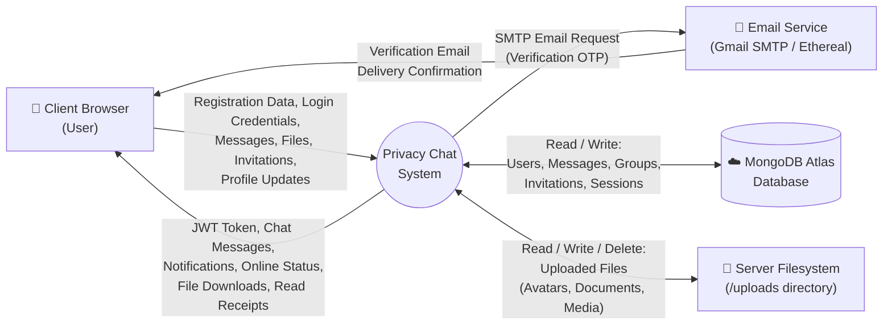
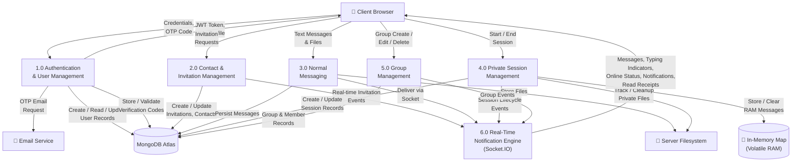
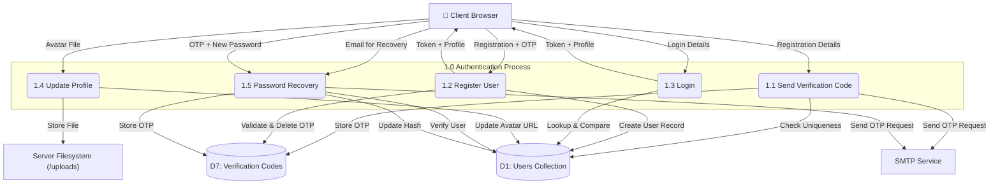
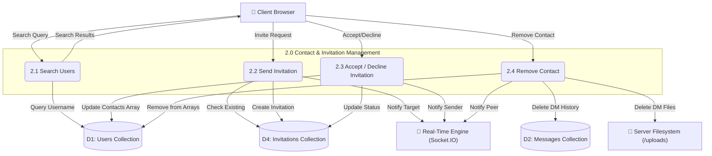
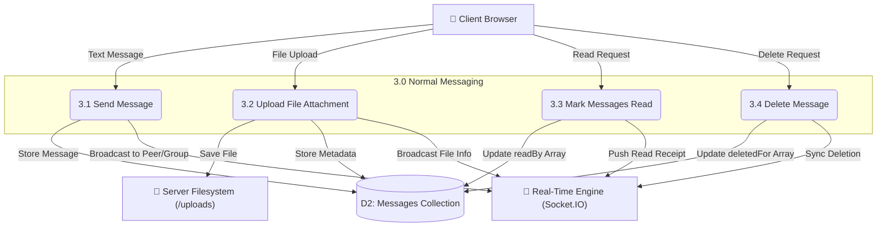
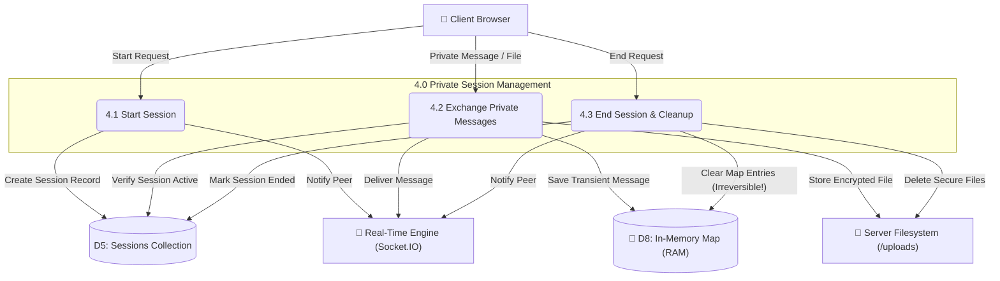
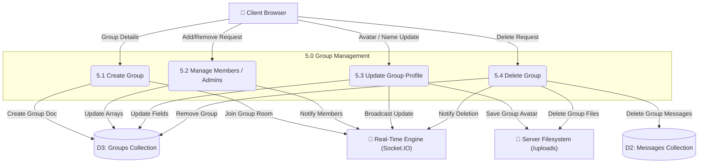
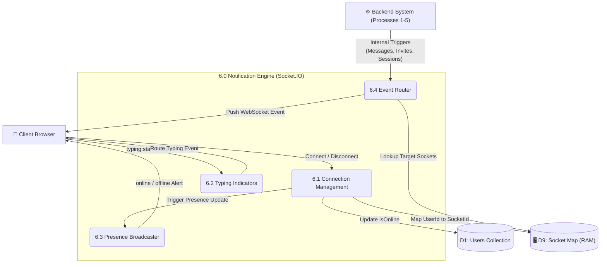
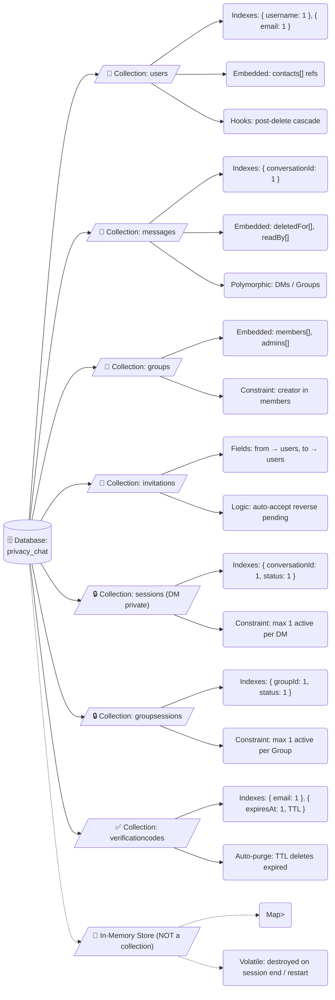

## 5.1) Data Flow Diagram

### 5.1.1) DFD Level 0 — Context Diagram

The Level 0 DFD represents the entire Privacy Chat system as a single process interacting with three external entities. It establishes the system boundary and shows the highest-level data flows entering and leaving the system.

External Entities:
- Client Browser (User): Represents any user accessing Privacy Chat through a web browser. All interactions flow through the React 19 frontend, which communicates with the backend via REST API calls (Axios) and WebSocket events (Socket.IO).
- Email Service (Gmail SMTP / Ethereal): External SMTP server used for sending 6-digit OTP verification codes during registration and password recovery. In production, Gmail SMTP is used; in development, Ethereal provides a testing fallback.
- MongoDB Atlas Database: Cloud-hosted NoSQL database storing all persistent data: user accounts, normal messages, groups, invitations, sessions, and verification codes.
- Server Filesystem: The `/uploads` directory on the backend server, used for storing uploaded files (avatars, images, documents, audio, video). Files associated with private sessions are tracked and deleted when the session ends.

---

### 5.1.2) DFD Level 1 — Subsystem Decomposition

The Level 1 DFD decomposes the Privacy Chat system into six major processing subsystems, showing the data flows between them and the data stores they access.

Process Descriptions:

| Process | Description |
|---------|-------------|
| 1.0 Authentication & User Management | Handles user registration (with email OTP verification), login (with JWT generation), profile updates (avatar, username), password changes, and password recovery. Interacts with the Email Service for OTP delivery and with MongoDB for user record CRUD operations. |
| 2.0 Contact & Invitation Management | Manages user search by username, invitation sending/accepting/declining, mutual contact addition, and contact removal with cascading cleanup (chat history deletion, file removal). |
| 3.0 Normal Messaging | Handles sending and receiving text messages and file attachments in DMs and groups. Messages are persisted to MongoDB and delivered in real-time via Socket.IO. Supports read receipts, message deletion (for me / for everyone), and the 500-character text limit. |
| 4.0 Private Session Management | The architectural core of the privacy system. Manages private session lifecycle (start, message exchange, end) for both DMs and groups. Messages are stored exclusively in the In-Memory Map and never written to MongoDB. Files uploaded during private sessions are tracked and deleted when the session ends. |
| 5.0 Group Management | Handles group CRUD operations, member management (add/remove), admin role management, group private sessions, and group deletion with message cascade. |
| 6.0 Real-Time Notification Engine | The Socket.IO server managing all real-time events: user online/offline status broadcasting, typing indicators (start/stop for DMs and groups), message delivery notifications, invitation alerts, read receipt propagation, private session lifecycle events, and unread count tracking. Maintains a `Map<userId, socketId>` for targeted message delivery. |

---

### 5.1.3) DFD Level 2 — Authentication Process (1.0) Decomposition

### 5.1.4) DFD Level 2 — Contact & Invitation Management (2.0) Decomposition

### 5.1.5) DFD Level 2 — Normal Messaging (3.0) Decomposition

### 5.1.6) DFD Level 2 — Private Session Management (4.0) Decomposition

### 5.1.7) DFD Level 2 — Group Management (5.0) Decomposition

### 5.1.8) DFD Level 2 — Real-Time Notification Engine (6.0) Decomposition

---

## 5.4) Schema Design and Strategies

The MongoDB schema for Privacy Chat follows a heavily optimized denormalised, embedded-reference hybrid architecture. 

### 5.4.1) Collection Hierarchy Overview

### 5.4.2) Implicit Conversation Tracking (No Junction Tables)

A major design decision was the **removal of a dedicated `conversations` table for DMs**. Instead, Direct Messaging (DM) conversations are tracked implicitly using a **deterministic computed key** format: `sorted(userId1_userId2)`. This completely eliminates the need for expensive secondary collection lookups just to verify if an active DM history exists between two users, lowering database overhead.

### 5.4.3) Embedded Arrays for Many-to-Many Relationships

Traditional SQL structures use junction tables for `M:N` relationships. MongoDB idiomatic design embeds related IDs directly inside arrays. Privacy Chat leverages this heavily:
- **`Users.contacts[]`**: Stores mutual contacts.
- **`Groups.members[]` & `Groups.admins[]`**: Replaces the need for a `Group_Members` collection.
- **`Messages.readBy[]` & `Messages.deletedFor[]`**: Arrays inherently track message receipts and soft-deletions cleanly without requiring nested subdocuments.

### 5.4.4) Polymorphic Message Architecture

Both Direct Messages and Group Messages co-exist in the exact same `Messages` collection. The schema relies on application-level polymorphism to render the messages correctly:
- DMs inject a `conversationId` while leaving `groupId: null`.
- Group Messages inject a `groupId` while leaving `conversationId: null`.
This choice radically simplifies backend query logic, allowing unified Socket.IO broadcast services and unified pagination pipelines regardless of the chat origin type.

### 5.4.5) Database Native Auto-Purging (TTL Index)

Registration verification logic generates thousands of 6-digit OTP codes. Instead of writing custom cleanup jobs or cron scripts to remove stale OTPs, Privacy Chat utilizes a MongoDB `TTL (Time-To-Live)` index:
`{ expiresAt: 1 }, { expireAfterSeconds: 0 }`
The background MongoDB Thread seamlessly purges `VerificationCode` documents instantly after the 10-minute expiry window, removing all server burden.

### 5.4.6) Strict Decoupling of Private Content (RAM Map)

Crucially, **Private Session content never interfaces with MongoDB**. 
The `Sessions` collection strictly records "metadata and lifecycle" events. However, the raw sensitive text and images sent during Private Sessions are stored solely in a Node.js Volatile Javascript `Map`. If the application restarts, or the PM session officially ends, all chat data instantly perishes, enforcing absolute non-recoverable privacy limits that purely rest within internal RAM arrays.
