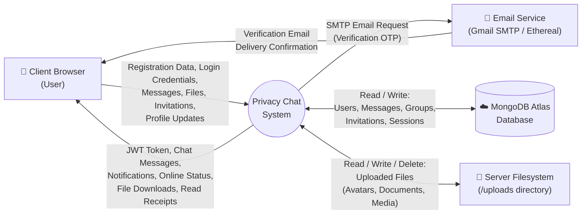
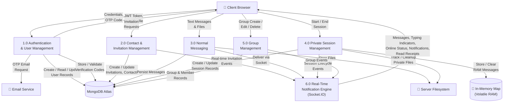
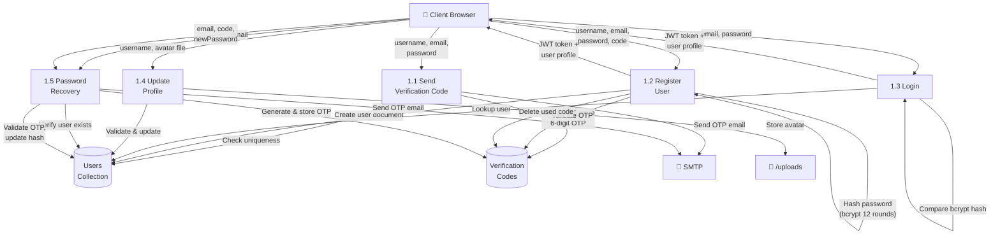

## 5.1) Data Flow Diagram

### 5.1.1) DFD Level 0 — Context Diagram

The Level 0 DFD represents the entire Privacy Chat system as a single process interacting with three external entities. It establishes the system boundary and shows the highest-level data flows entering and leaving the system.



External Entities:
- Client Browser (User): Represents any user accessing Privacy Chat through a web browser. All interactions flow through the React 19 frontend, which communicates with the backend via REST API calls (Axios) and WebSocket events (Socket.IO).
- Email Service (Gmail SMTP / Ethereal): External SMTP server used for sending 6-digit OTP verification codes during registration and password recovery. In production, Gmail SMTP is used; in development, Ethereal provides a testing fallback.
- MongoDB Atlas Database: Cloud-hosted NoSQL database storing all persistent data: user accounts, normal messages, groups, invitations, sessions, and verification codes.
- Server Filesystem: The `/uploads` directory on the backend server, used for storing uploaded files (avatars, images, documents, audio, video). Files associated with private sessions are tracked and deleted when the session ends.

---

### 5.1.2) DFD Level 1 — Subsystem Decomposition

The Level 1 DFD decomposes the Privacy Chat system into six major processing subsystems, showing the data flows between them and the data stores they access.



Process Descriptions:

| Process | Description |
|---------|-------------|
| 1.0 Authentication & User Management | Handles user registration (with email OTP verification), login (with JWT generation), profile updates (avatar, username), password changes, and password recovery. Interacts with the Email Service for OTP delivery and with MongoDB for user record CRUD operations. |
| 2.0 Contact & Invitation Management | Manages user search by username, invitation sending/accepting/declining, mutual contact addition, and contact removal with cascading cleanup (chat history deletion, file removal). |
| 3.0 Normal Messaging | Handles sending and receiving text messages and file attachments in DMs and groups. Messages are persisted to MongoDB and delivered in real-time via Socket.IO. Supports read receipts, message deletion (for me / for everyone), and the 500-character text limit. |
| 4.0 Private Session Management | The architectural core of the privacy system. Manages private session lifecycle (start, message exchange, end) for both DMs and groups. Messages are stored exclusively in the In-Memory Map and never written to MongoDB. Files uploaded during private sessions are tracked and deleted when the session ends. |
| 5.0 Group Management | Handles group CRUD operations, member management (add/remove), admin role management, group private sessions, and group deletion with message cascade. |
| 6.0 Real-Time Notification Engine | The Socket.IO server managing all real-time events: user online/offline status broadcasting, typing indicators (start/stop for DMs and groups), message delivery notifications, invitation alerts, read receipt propagation, private session lifecycle events, and unread count tracking. Maintains a `Map<userId, socketId>` for targeted message delivery. |

---

### 5.1.3) DFD Level 2 — Authentication Process (1.0) Decomposition



---

## 5.4) Schema Design Overview

The MongoDB schema follows a denormalised, embedded-reference hybrid approach. Related IDs are embedded as arrays within parent documents rather than using separate junction collections, which is idiomatic for MongoDB and reduces query complexity.

```
Database: privacy_chat
│
├── Collection: users
│   ├── Indexes: { username: 1, unique }, { email: 1, unique }
│   ├── Embedded Arrays: contacts[] (ObjectId refs to self)
│   └── Hooks: post-delete cascades contact removal
│
├── Collection: messages
│   ├── Indexes: { conversationId: 1 }
│   ├── Embedded Arrays: deletedFor[], readBy[]
│   └── Polymorphic: DMs use conversationId; groups use groupId
│
├── Collection: groups
│   ├── Embedded Arrays: members[], admins[]
│   └── Constraint: creator always included in members
│
├── Collection: invitations
│   ├── Fields: from → users, to → users
│   └── Logic: auto-accept reverse pending invitations
│
├── Collection: sessions (DM private)
│   ├── Indexes: { conversationId: 1, status: 1 }
│   └── Constraint: max one active per conversationId
│
├── Collection: groupsessions
│   ├── Indexes: { groupId: 1, status: 1 }
│   └── Constraint: max one active per groupId
│
├── Collection: verificationcodes
│   ├── Indexes: { email: 1 }, { expiresAt: 1, TTL: 0 }
│   └── Auto-purge: TTL index deletes expired documents
│
└── In-Memory Store (NOT a collection):
    └── Map<sessionId, Array<MessageObject>>
        └── Volatile — destroyed on session end / disconnect / restart
```

Key Schema Design Principles:

1. No Separate Conversation Table: DM conversations are identified by a deterministic computed key (`sorted(userId1_userId2)`), avoiding an additional collection lookup.

2. Polymorphic Message Collection: Both DMs and group messages share a single `messages` collection, differentiated by `conversationId` (DMs) vs. `groupId` (groups).

3. Array-Based Relationships: MongoDB's flexible array fields eliminate the need for SQL-style junction tables. Contacts, group members, read receipts, and soft deletes are all modelled as embedded arrays.

4. TTL Index for Auto-Cleanup: Verification codes self-destruct via MongoDB's TTL index mechanism, requiring zero application-level cleanup logic.

5. Volatile Private Store: The `Map` is deliberately chosen over Redis or any persistent store to guarantee that private messages cannot survive any form of server termination.
