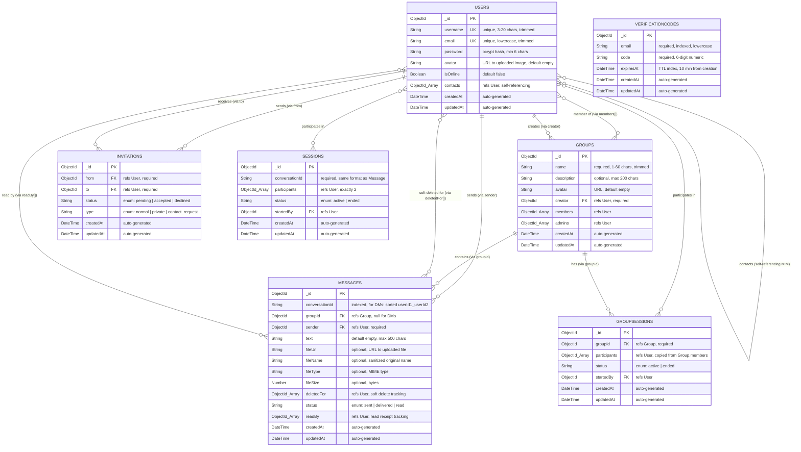

## 5.2) ER Diagram

The following Mermaid code describes the Entity-Relationship diagram for the Privacy Chat MongoDB collections. Each entity maps directly to a Mongoose schema defined in the `backend/models/` directory. Field names, types, and constraints correspond exactly to the implemented codebase.

### Relationship Descriptions

1. User ↔ User (Many-to-Many, self-referencing via `contacts` array): A user can have many contacts; each contact is also a user. This is a mutual, bidirectional relationship — when User A accepts User B's invitation, both users' `contacts` arrays are updated using the `$addToSet` operator to prevent duplicates.

2. User → Message (One-to-Many via `sender`): Each message has exactly one sender. A user can send an unlimited number of messages across multiple conversations and groups.

3. User → Message (Many-to-Many via `deletedFor`): The `deletedFor` array enables per-user soft deletion. When a user deletes a message "for me," their ObjectId is appended to this array. Queries filter messages where the requesting user's ID appears in `deletedFor`, rendering the message invisible to that user while preserving it for other participants.

4. User → Message (Many-to-Many via `readBy`): The `readBy` array tracks which users have read a given message, enabling read receipt functionality. The `status` field (`sent` → `delivered` → `read`) provides a summary status for UI display (single checkmark, double checkmark, blue checkmark).

5. User → Group (One-to-Many via `creator`): Each group has exactly one creator who cannot leave the group and is the only user authorized to delete it.

6. User ↔ Group (Many-to-Many via `members` and `admins`): The `members` array tracks all group participants, while the `admins` array (a subset of members) governs which users can add/remove members, edit group info, and start private sessions.

7. User → Invitation (One-to-Many via `from` and `to`): Invitations are directional — one user sends (`from`) and another receives (`to`). The system detects reverse pending invitations (where the target has already invited the sender) and auto-accepts them to establish mutual contact.

8. Group → Message (One-to-Many via `groupId`): Group messages use the `groupId` field instead of `conversationId`. The Message collection is polymorphic — DM messages have `conversationId` set and `groupId` null; group messages have `groupId` set and `conversationId` null.

9. Group → GroupSession (One-to-Many via `groupId`): Each group can have multiple private sessions over time, but only one can be `active` at any given moment.

10. Session (DM Private Sessions): The `Session` model tracks 1:1 private sessions using a `conversationId` (identical format to `Message.conversationId`) and a `participants` array containing exactly two user ObjectIds.

> Note on Private Messages: Private messages are deliberately excluded from the ER diagram because they are never persisted to MongoDB. They exist exclusively in a server-side JavaScript `Map<sessionId, Array<messageObject>>` (defined in `socket/privateStore.js`) and are irrecoverably destroyed when the session ends.
