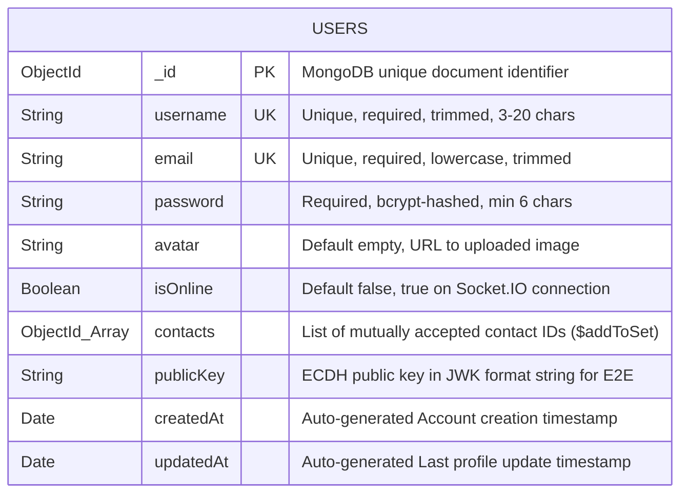
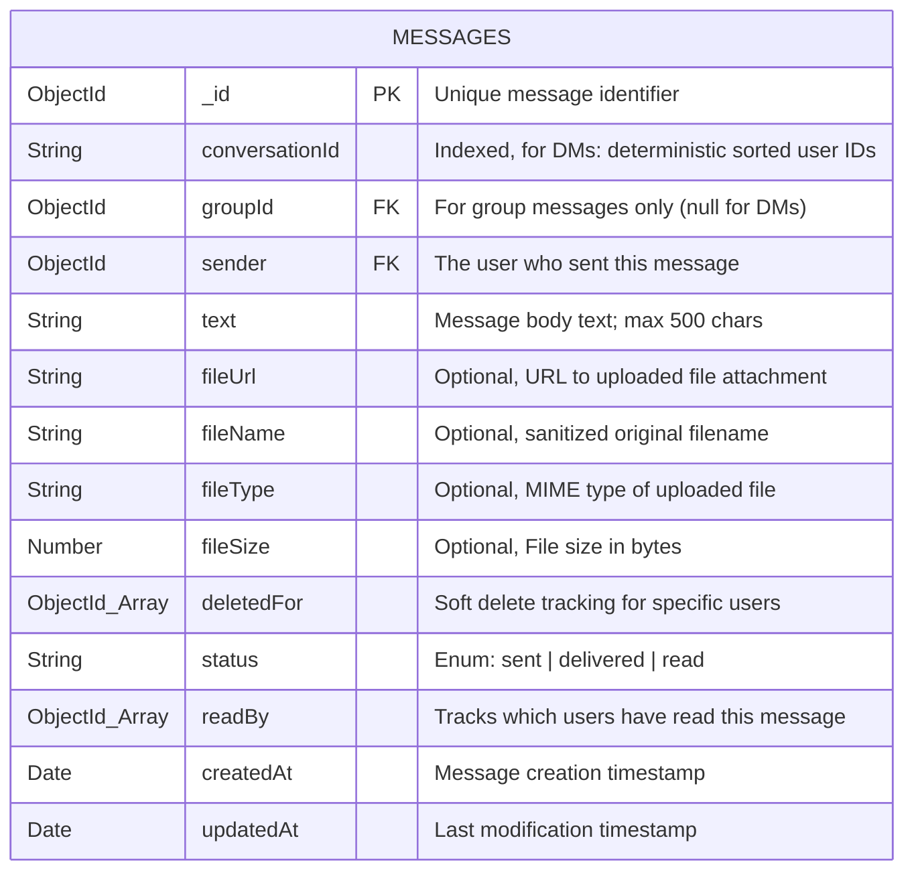
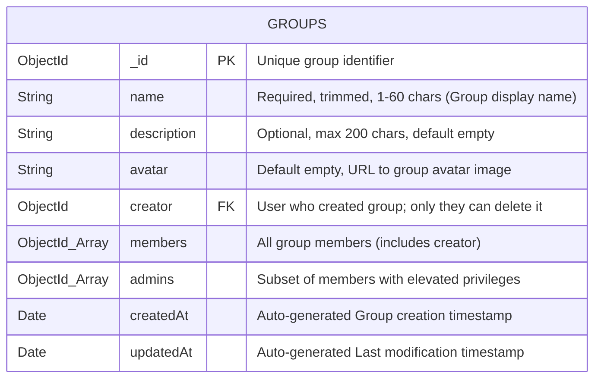
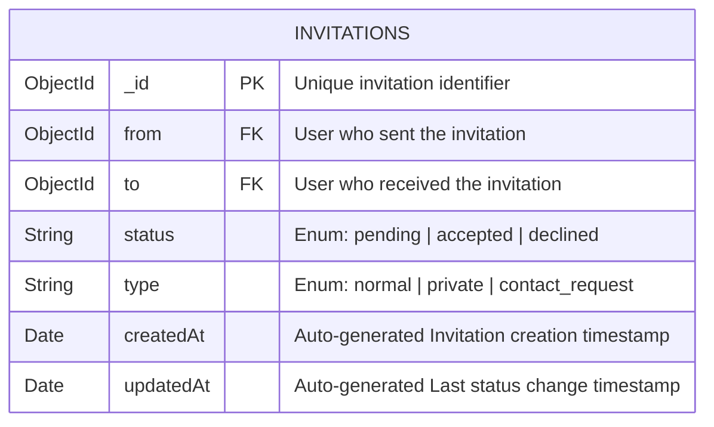
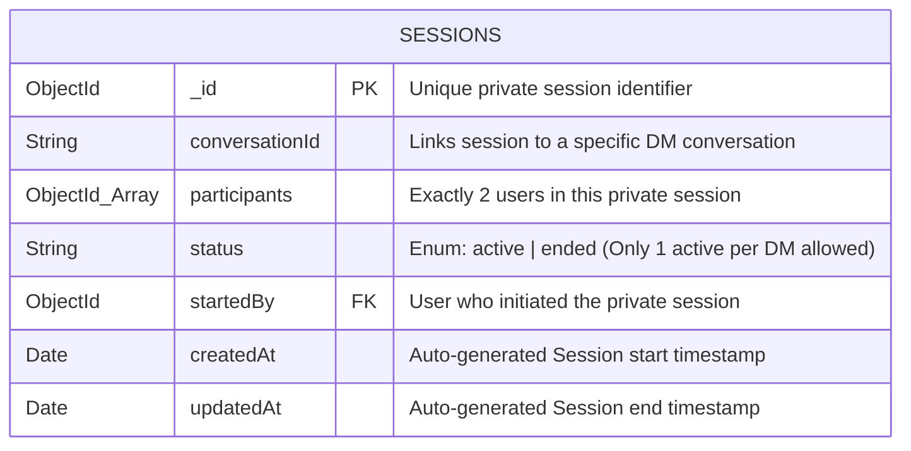
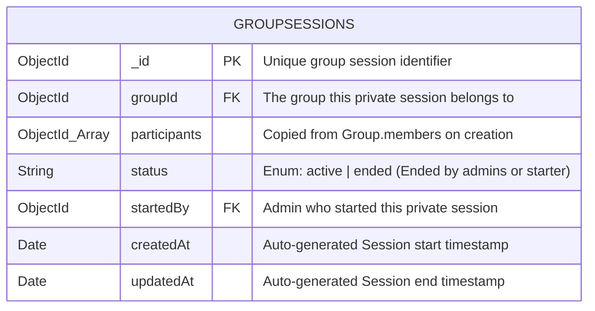
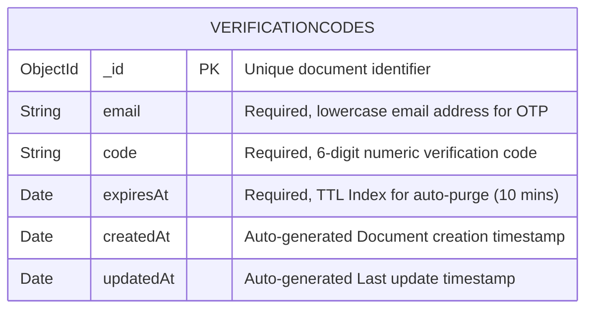
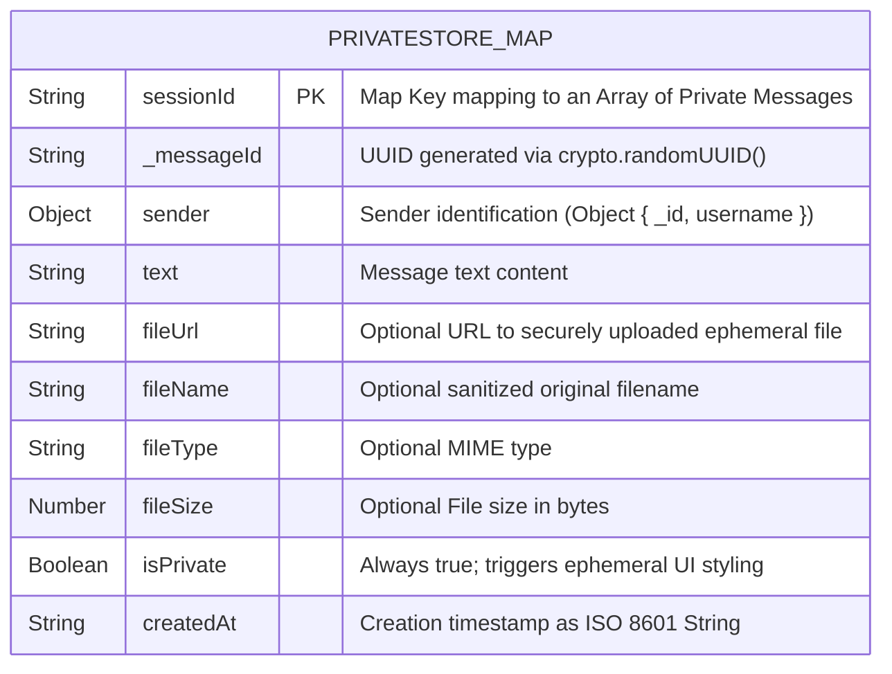

## 5.3) Data Dictionary and Table Design

> **Note:** This section has been split into two separate documents for clarity:
>
> - **[section_5_3a_data_dictionary.md](section_5_3a_data_dictionary.md)** — Field-level definitions (data types, constraints, descriptions) for all collections and the in-memory store.
> - **[section_5_3b_table_design.md](section_5_3b_table_design.md)** — Structural table design with Mermaid ER diagrams for each collection and a combined relationship diagram.

### 5.3.1) Users Collection

**Indexes:** `{ username: 1, unique: true }`, `{ email: 1, unique: true }`
**Mongoose Hooks:** `post('findOneAndDelete')` and `post('deleteOne')` cascade contact removal.

---

### 5.3.2) Messages Collection

**Indexes:** `{ conversationId: 1 }`
**Design Note:** Private (ephemeral) messages are NOT stored in this collection. They live only in RAM via `privateStore.js`.

---

### 5.3.3) Groups Collection

---

### 5.3.4) Invitations Collection

**Business Logic:** When sending an invitation, the system checks for a reverse pending invitation. If found, it auto-accepts and establishes mutual contact natively, avoiding duplicate invitations.

---

### 5.3.5) Sessions Collection (DM Private Sessions)

---

### 5.3.6) GroupSessions Collection (Group Private Sessions)

---

### 5.3.7) VerificationCodes Collection

**TTL Auto-Purge:** The `expiresAt` field uses MongoDB's background TTL thread to automatically delete the document when the time expires, eliminating the need for a scheduled cleanup job.

---

### 5.3.8) Private Message In-Memory Store (NOT a MongoDB Collection)

Private messages are deliberately excluded from MongoDB. They are stored in a server-side JavaScript `Map` defined in `socket/privateStore.js`.

**Lifecycle:** Created on session start → populated during session → completely destroyed (`Map.delete(sessionId)`) on session end, socket disconnect, page unload, or server restart. Associated files on disk are also deleted via `fs.unlink()`.

---

### 5.3.9) Data Model Design Decisions

1. **Deterministic Conversation ID:** DM conversations are identified by a computed string (`[smallerUserId]_[largerUserId]`) rather than a separate structured Collection, eliminating lookup tables.
2. **Polymorphic Message Collection:** A single `messages` collection stores both DM and group messages, simplifying querying and streaming.
3. **Soft Delete via Array:** The `deletedFor` array enables per-user message visibility efficiently without duplicating data or breaking shared logs.
4. **Embedded Arrays over Junction Tables:** MongoDB favours embedding related IDs directly in documents rather than relying on junction SQL-style collections.
5. **RAM-Only Private Store:** Provides the strongest guarantee of ephemerality by avoiding the database completely.
