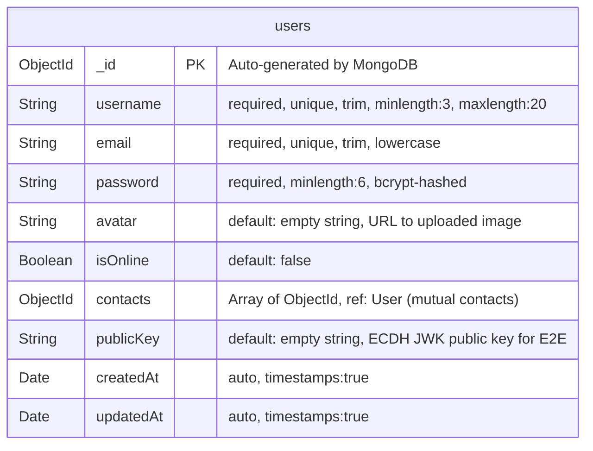
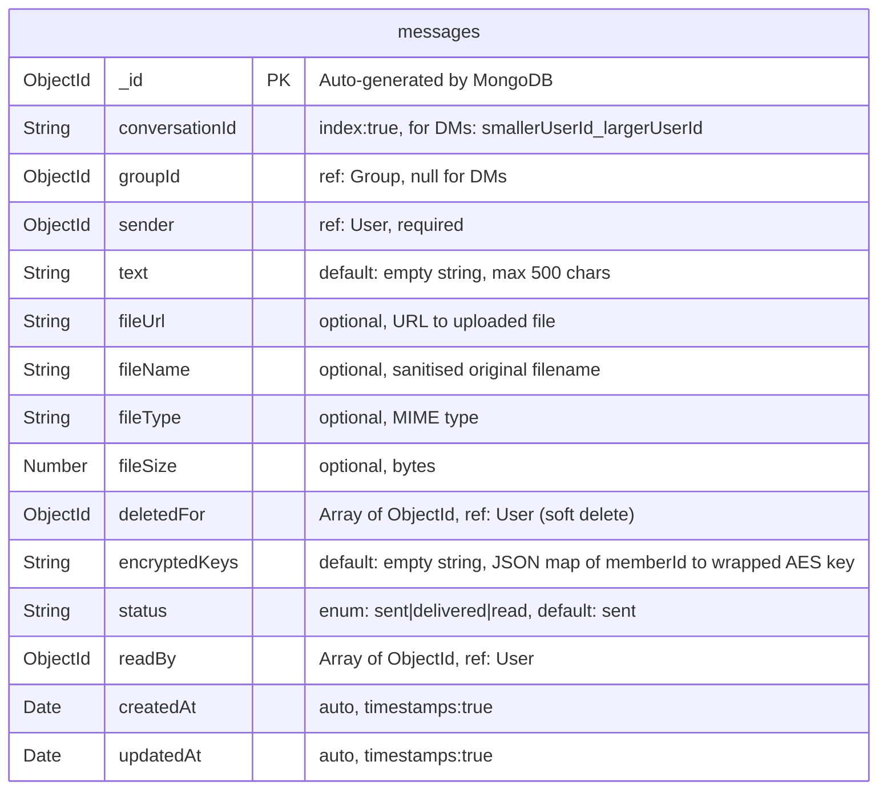
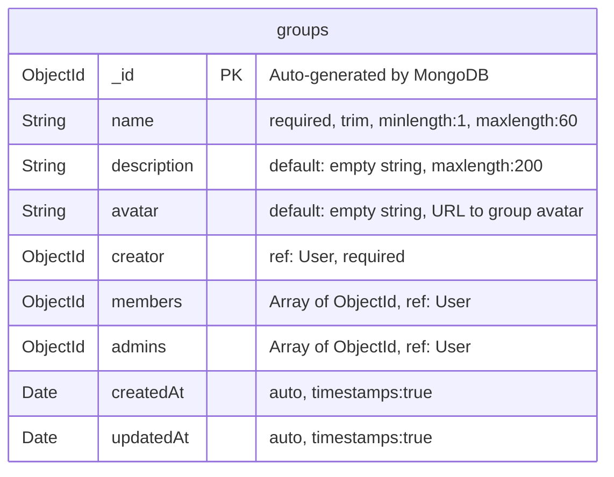
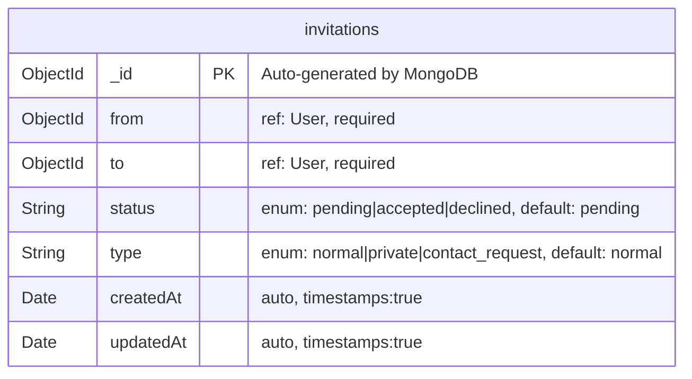
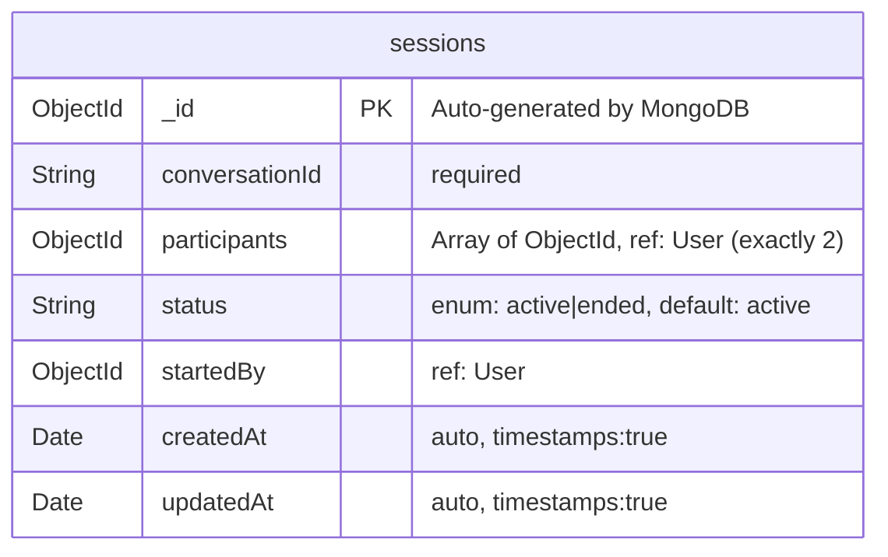
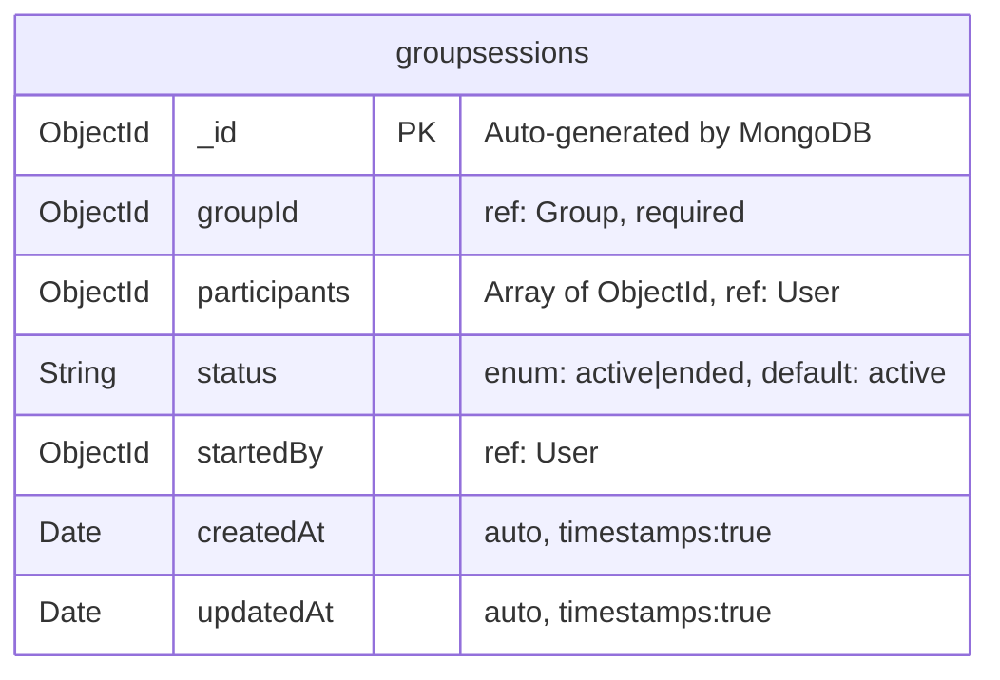
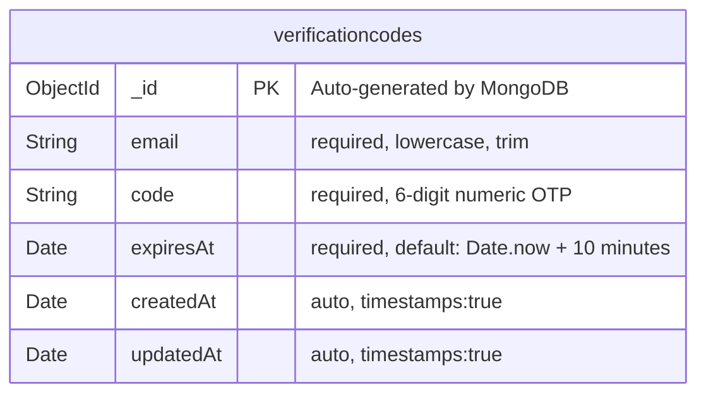
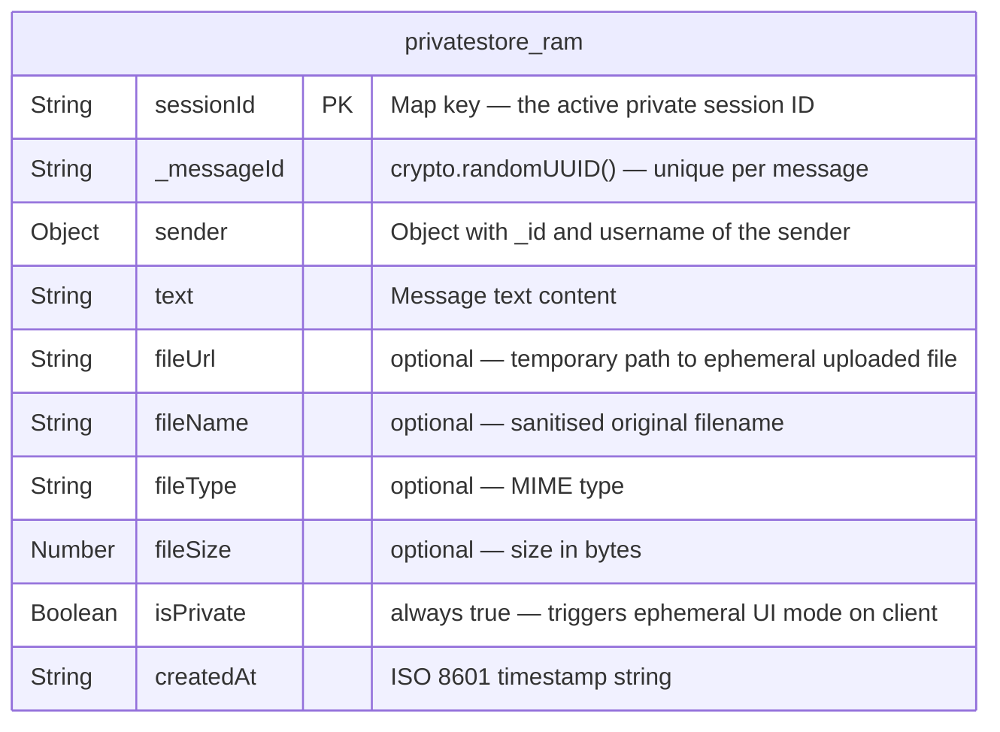
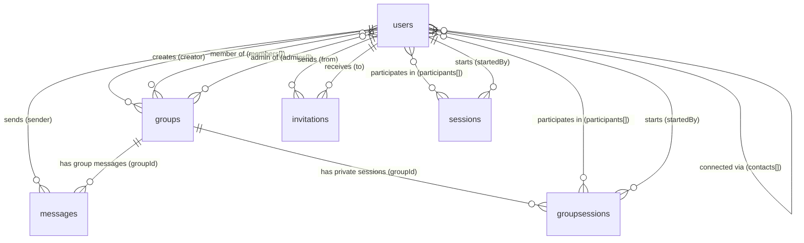

## 5.4) Table Design

This section presents the exact structural design of every MongoDB collection used by Privacy Chat, derived directly from the Mongoose schema definitions in the source code. Each Mermaid `erDiagram` block reflects the precise field names, data types, key constraints, default values, and indexes as defined in the model files. The in-memory private message store is also documented for completeness.

---

### 5.4.1) users Collection
**Model file:** `backend/models/User.js`

**Indexes:**
- `{ username: 1, unique: true }`
- `{ email: 1, unique: true }`

**Post-delete hooks:** `findOneAndDelete` and `deleteOne` cascade to remove this user from all other users' `contacts` arrays.

---

### 5.4.2) messages Collection
**Model file:** `backend/models/Message.js`

**Indexes:**
- `{ conversationId: 1 }` (inline `index: true` on field)

**Note:** Private messages are **never** stored here. They live exclusively in the RAM `Map` in `socket/privateStore.js`.

---

### 5.4.3) groups Collection
**Model file:** `backend/models/Group.js`

---

### 5.4.4) invitations Collection
**Model file:** `backend/models/Invitation.js`

---

### 5.4.5) sessions Collection (DM Private Sessions)
**Model file:** `backend/models/Session.js`

---

### 5.4.6) groupsessions Collection (Group Private Sessions)
**Model file:** `backend/models/GroupSession.js`

---

### 5.4.7) verificationcodes Collection
**Model file:** `backend/models/VerificationCode.js`

**Indexes:**
- `{ expiresAt: 1 }, { expireAfterSeconds: 0 }` — TTL index: MongoDB auto-deletes document when `expiresAt` is reached
- `{ email: 1 }` — for fast OTP lookup by email

---

### 5.4.8) Private Message Store (RAM — Not a MongoDB Collection)
**Source file:** `backend/socket/privateStore.js`

This is a JavaScript `Map<sessionId, messageObject[]>` held in volatile server RAM. It is **never** written to MongoDB or disk.

**Destruction paths:** `Map.delete(sessionId)` is called on session end, socket disconnect, Beacon API page-unload, or server restart. Any associated files are deleted from disk via `fs.unlink()` concurrently.

---

### 5.4.9) Inter-Collection Relationship Diagram

