# Functional Decomposition Diagram

## Overview

The functional decomposition diagram below breaks the Privacy Chat system into its primary functional subsystems and further decomposes each into its constituent functions. This hierarchical representation clarifies the boundaries between modules and the responsibilities assigned to each component of the system.

```mermaid
mindmap
  root((Privacy Chat System))
    Authentication and Account Management
      Register User
        Send OTP via SMTP
        Verify OTP Code
        Hash Password with bcrypt
        Create User Record
      Login User
        Validate Credentials
        Issue JWT via HttpOnly Cookie
      Logout User
        Clear Auth Cookie
      Recover Password
        Send Recovery OTP
        Verify OTP
        Update Password Hash
      Manage Profile
        Update Username
        Upload Avatar Image
        Change Password

    Contact and Invitation Management
      Search Users by Username
      Send Contact Invitation
      Accept Invitation
        Add Mutual Contacts
        Notify via Socket
      Decline Invitation
      Remove Contact
        Delete Shared Messages
        Delete Shared Files
        Remove Bilateral References

    Direct Messaging
      Send Text Message
        Validate 500 Char Limit
        Persist to MongoDB
        Deliver via Socket.IO
      Send File Attachment
        Validate MIME Type
        Enforce 100 MB Limit
        Store in Uploads Directory
      Delete Message
        Delete For Me
        Delete For Everyone
          Remove File from Disk
      Read Receipts
        Mark as Delivered
        Mark as Read
        Emit Status Update
      Typing Indicator
        Broadcast Typing Event
      End to End Encrypt Message
        ECDH Key Exchange
        Derive AES-GCM Key
        Encrypt on Sender Client
        Decrypt on Recipient Client
        Store Keys in IndexedDB

    Group Chat
      Create Group
        Set Name and Avatar
        Assign Creator as Admin
      Manage Members
        Add Member
        Remove Member
        Leave Group
      Manage Admins
        Promote to Admin
        Demote Admin
      Edit Group Info
      Delete Group
        Cascade Delete Messages
        Cascade Delete Files
      Send Group Message
        Encrypt with Sender Key Pattern
        Wrap Per Member Key
        Deliver to All Members
      Send Group File

    Private Ephemeral Messaging
      Initiate DM Private Session
        Create Session Record in DB
        Initialise RAM Message Store
        Notify Participants via Socket
      Initiate Group Private Session
        Copy Current Member List
        Create GroupSession Record
        Initialise RAM Message Store
      Send Private Message
        Store in RAM Map Only
        Never Write to MongoDB
      Send Private File
        Store Temporarily on Disk
      End Private Session
        Clear RAM Message Store
        Delete Private Files from Disk
        Mark Session Ended in DB
        Notify Participants via Socket
      Auto Cleanup on Disconnect
        Detect Socket Disconnect
        Trigger Session Cleanup
      Auto Cleanup on Tab Close
        Capture Beacon API Event
        Trigger Session Cleanup

    Real Time Communication
      Manage WebSocket Connections
        Authenticate Socket via Cookie
        Register User Socket ID
        Handle Disconnect
      Broadcast Online Status
        Emit Online on Connect
        Emit Offline on Disconnect
      Deliver Typing Indicators
        Private Chat Typing
        Group Chat Typing
      Deliver Unread Badges
        Count Unread per Conversation
        Push Count on New Message
      In App Notification Bell
        New Message Alert
        Invitation Alert
        Private Session Alert

    Security
      JWT Authentication Middleware
        Verify Token from Cookie
        Attach User to Request
        Reject Expired Tokens
      Rate Limiting
        20 Requests per 15 Minutes
        Apply to Auth Routes
      HTTP Security Headers
        Content Security Policy
        X Frame Options
        via Helmet Middleware
      CORS Enforcement
        Allow Frontend Origin Only
        Reject Other Origins
      File Upload Security
        MIME Type Whitelist
        Filename Sanitisation
        Size Cap 100 MB
      Password Security
        bcrypt Hash 12 Salt Rounds

    User Interface
      Responsive Layout
        Desktop View
        Mobile View
      Theme Toggle
        Light Mode
        Dark Mode
        Persist via localStorage
      Chat Window
        Message List
        Input Box
        File Upload Button
      Sidebar
        Contact List with Unread Badges
        Group List
        Online Status Indicators
      Notification Panel
        Bell Icon with Count
        Alert List
```

## Description

The root node represents the complete Privacy Chat system. It decomposes into seven primary functional subsystems:

**Authentication and Account Management** covers all identity-related operations from initial registration through email OTP verification to profile updates and password recovery.

**Contact and Invitation Management** governs the invitation-based social graph, including user discovery, invitation lifecycle (send, accept, decline), and cascading cleanup on contact removal.

**Direct Messaging** encompasses real-time one-to-one text and file communication, message lifecycle management (read receipts, deletion), typing indicators, and the end-to-end encryption pipeline using ECDH key exchange and AES-GCM symmetric encryption with keys stored in IndexedDB.

**Group Chat** covers the full group lifecycle from creation and membership management through encrypted group messaging using the Sender-Key pattern with per-member key wrapping.

**Private Ephemeral Messaging** is the core privacy feature, handling session initiation, RAM-only message storage, private file management, and multi-pathway cleanup (explicit end, disconnect, and Beacon API tab close).

**Real-Time Communication** represents the Socket.IO infrastructure layer responsible for WebSocket connection management, online presence broadcasting, typing indicators, unread badge delivery, and in-app notifications.

**Security** covers all cross-cutting security controls: JWT middleware, rate limiting, Helmet HTTP headers, CORS, file upload hardening, and password hashing.

**User Interface** captures the client-side presentation layer including responsive layout, theme toggling, the chat window, the sidebar, and the notification panel.
